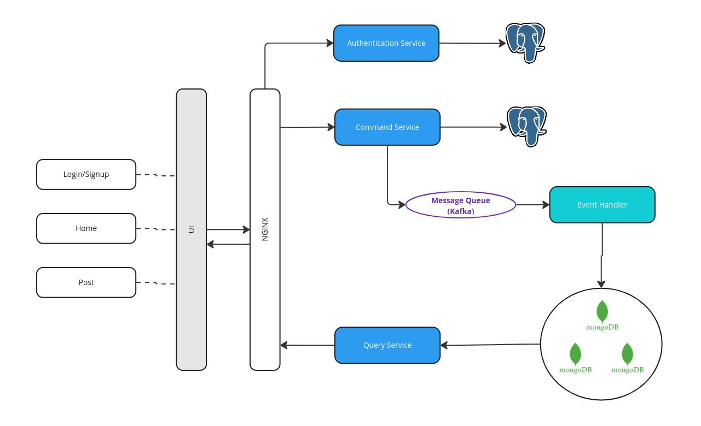

# Hackernews Clone

## Architecture

## Tasks

### Core
- Write API documentation
    - [ ] ER Diagram
    - [ ] API Endpoints
- Implement Authentication Service
    - [ ] Setup PostgreSQL
    - [ ] Sign up
    - [ ] Sign in
- Implement Command Service
    - [ ] Setup PostgreSQL 
    - [ ] Create post
    - [ ] Create comment
- Implement Query Service
    - [ ] Setup MongoDB
    - [ ] Get post
    - [ ] Get comment
- Implement Event Handler
    - [ ] Listen to `new_post` topic
    - [ ] Listen to `new_comment` topic
- UI
    - [ ] Sign up
    - [ ] Sign in
    - [ ] Post list (home page)
    - [ ] Post detail
    - [ ] Create post

### Nice to have
- [ ] Able to refresh token
- [ ] Replicate database
- [ ] Add table `tags`
- [ ] Denormalize data in Query Service

## Components

### API Gateway
- Use **Nginx** to route requests to the appropriate service.

### Authentication Service
- Use JWT with asymmetric algorithm (RS256) to sign and verify tokens.
- Private key is managed by Authentication Service.
- Public key is shared with other services.
- Table `users` stores user information.
- Use `PostgreSQL` as database.

### Command Service
- Table `posts` stores post information.
- Table `comments` stores comment information.
- Table `tags` stores tag information (optional).
- Use `PostgreSQL` as database.

### Message Queue
- Use `Kafka` as message queue.
- Topic `new_post` is used to publish new post.
- Topic `new_comment` is used to publish new comment.

### Query Service
- Table `posts` stores post information.
- Table `comments` stores comment information.
- Use `MongoDB` as database.
- Replicate database to 2-3 nodes (optional).
- Table `tags` stores tag information (optional).
- Denormalize data to reduce query complexity (optional).

### Event Handler
- Listen to `new_post` topic and insert new post to `posts` table.
- Listen to `new_comment` topic and insert new comment to `comments` table.

## Notes
- Use as **many programming languages** as possible :D (Python, Javascript, etc).
- Use **Docker** and **Docker Compose** to manage services (required).